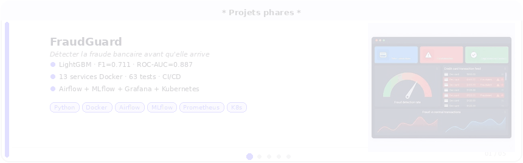

<div align="center">

</div>

<p align="center">
  
</p>

<p align="center">
  <a href="mailto:tahiana.hajanirina@outlook.com"></a>
  <a href="https://www.linkedin.com/in/tahiana-andriambahoaka"></a>
  <a href="https://github.com/tahianahajanirina"></a>
</p>

---

```python
tahiana = {
    "role"      : "MLOps Engineer · NLP & Deep Learning",
    "formation" : "MS® IA Expert Data & MLops — Télécom Paris (IP Paris)",
    "location"  : "Paris, France 🇫🇷",
    "languages" : ["Français 🇫🇷", "Malgache 🇲🇬", "Anglais 🇬🇧"],
    "focus"     : ["MLOps en production", "NLP & Transformers", "Big Data Pipelines"],
    "looking"   : "Stage / CDI MLOps & ML Engineering — Île-de-France",
    "motto"     : "Je ne livre pas des modèles. Je livre des systèmes qui tiennent en prod. 🚀",
}
```

---

## 🚀 Projets phares

<div align="center">
  
</div>

<!-- Détail des projets (pour référencement) -->
<details>
<summary><b>Voir le détail des projets</b></summary>

<table>
<tr>
<td width="50%" valign="top">

### 🔍 FraudGuard
> **Détecter la fraude bancaire avant qu'elle arrive.**

Pipeline MLOps complet de bout en bout : ingestion, entraînement automatisé, API de prédiction temps réel, monitoring production — le tout orchestré avec Airflow et containerisé avec Docker.

- 🧠 Modèle LightGBM · F1 = 0.711 · ROC-AUC = 0.887
- ⚙️ Retraining automatique déclenché par Airflow
- 📊 Dashboard Grafana + alertes Prometheus en temps réel
- 🚀 API FastAPI · 63 tests · déployable sur Kubernetes


[](https://github.com/tahianahajanirina/Fraudguard)

</td>
<td width="50%" valign="top">

### 🏷️ HieraCat &nbsp; 
> **Classer des millions de produits, automatiquement et avec précision.**

Système de classification hiérarchique profonde pour catégoriser des produits e-commerce à grande échelle — sur deux niveaux : catégorie principale et sous-catégorie fine.

- 🗂️ 157 catégories · 6 059 sous-catégories
- 🤖 CamemBERT fine-tuné · 3 variantes (Local, Global, Nested)
- ⚡ Entraînement distribué multi-GPU sur cluster SLURM
- 📈 Tracking MLflow · explicabilité Gradient × Input · 77 tests


</td>
</tr>
<tr>
<td width="50%" valign="top">

### ✈️ SkySafe Datalake
> **Surveiller le trafic aérien français en temps réel avec le Big Data.**

Pipeline Big Data qui ingère toutes les minutes les positions GPS des avions, les croise avec la météo, et calcule un score de risque aéronautique affiché sur un dashboard interactif.

- 📡 Ingestion temps réel · OpenSky API · proxy Serverless Scaleway
- 🌊 Architecture Data Lake 4 couches sur Amazon S3
- 🤖 Classification phases de vol K-Means (Spark MLlib) + anomalies
- 📊 Dashboard Kibana · Score de risque FAA 0–100 · 29 tests


[](https://github.com/tahianahajanirina/skysafe-datalake)

</td>
<td width="50%" valign="top">

### 🍽️ MangetaMain
> **Recommander des recettes personnalisées grâce au Machine Learning.**

Plateforme ML complète d'analyse et de recommandation de recettes : clustering utilisateurs, analyse nutritionnelle, analyse de sentiment et recommandation collaborative.

- 👤 Clustering utilisateurs & recettes (K-Means)
- 🥗 Tagger nutritionnel automatique
- 💬 Analyse de sentiment fine-tunée sur les avis culinaires
- 🤖 Chatbot Gemini · Recommandation SVD · 124 tests


[](https://github.com/tahianahajanirina/mangetamain)

</td>
</tr>
<tr>
<td width="50%" valign="top">

### 🏥 DocRAG-MD
> **Répondre à des questions médicales complexes avec des agents LLM spécialisés.**

Plateforme RAG multi-agents production-grade pour la Q&A clinique : 4 agents LangGraph spécialisés (diagnostic, pharmacologie, général, évaluateur), GraphRAG sur PrimeKG (100k+ nœuds, 4M+ arêtes), Self-RAG et CRAG pour la fidélité des réponses.

- 🧠 4 LLMs au choix : Gemini 2.5 Flash/Pro, BioMistral 7B local, GPT-4o
- 📚 301k chunks StatPearls + 36M+ articles PubMed (API live)
- 🔍 GraphRAG · Self-RAG · CRAG · Deep Search multi-step
- 📊 Observabilité Langfuse v3 · 62%+ accuracy MedMCQA · 11 services Docker


[](https://github.com/tahianahajanirina/DocRAG-MD)

</td>
<td width="50%" valign="top">
</td>
</tr>
</table>
</details>

---

## 🛠️ Stack technique

**ML & NLP**


**MLOps & Infrastructure**


**Observabilité**


**Big Data**


**HPC**


---

## 📊 Stats GitHub

<p align="center">
  
</p>
<p align="center">
  
  
  
</p>
<p align="center">
  
</p>

---

[](https://github.com/tahianahajanirina)
